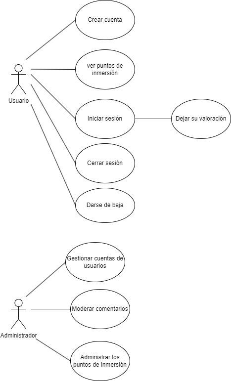

# Anteproyecto

## OBJETIVOS

El objetivo de la aplicación será mostrar los puntos de buceo de Tenerife. Los usuarios podrán dejar comentarios y valoraciones sobre las inversiones.

## ANÁLISIS DEL SOFTWARE

Los objetivos principales de la aplicación son:
- Mostrar al usuario los diferentes puntos de inversión de Tenerife
- Al elegir un punto mostrar la información de este y las valoraciones y comentarios de otros usuarios
- Permitir al usuario añadir su valoración, una vez haya iniciado sesión
- El administrador del sitio podrá eliminar usuarios y/o comentarios

## 

## DISEÑO DEL SOFTWARE

El desarrollo de la aplicación se realizará con Python y Django. Se empezará planteando el frontend y el modelo de datos para luego desarrollar el backend.

- El frontend se desarrollará con los templates o plantillas generados con Django, HTML, CSS.
- El backend se desarrollará con Python.
- Para almacenar la información se utilizará una base de datos Sqlite administrada por Django.

## ESTIMACIÓN DE COSTES

El único coste será temporal, ya que en principio no se usarán recursos que tengan algún gasto. La duración del desarrollo de la aplicación será de aproximadamente 100 horas
